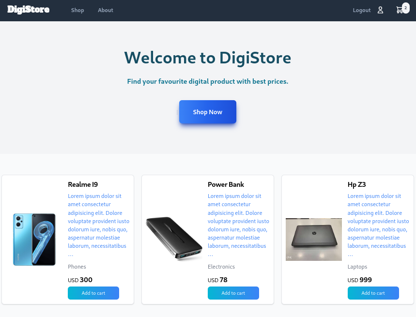
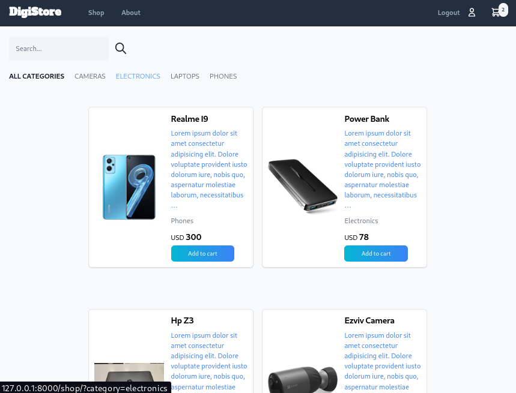
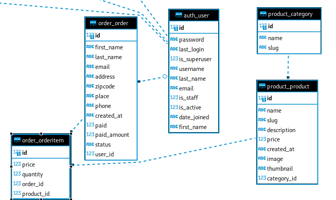

<h2 align="center">DigiStore Ecommerce</h2>
<p align="center">

</p>

<h5>A full stack Ecommerce website made with Django, HTMX & Tailwindcss.</h5>

<p align="center">

</p>


##### Database

SQLITE is used for dev, Postgres in production.

##### Schema



#### Start

* Clone the repo:  ***git clone*** **<https://github.com/Ahmed-Abdelgawad-Dev/Ecommerce-Django.git>**

* Use a virtual environment that you prefere.Could be pipenv | venv | conda, go to Ecommerce folder.

* activate your choice virtual environment(UNIX)

```shell
source ./venv/bin/activate
```

* Install the required packages for the project.

```shell
pip install -r requirements.txt
```

* Migrate:

```shell
python manage.py migrate
```

* create a user if needed or use (usr:admin - pwd:admin)

```shell
python manage.py createsuperuser
```

* run the project

```shell
python manage.py runserver
```

* Generate a secret key for Django if required

```python
from django.core.management.utils import get_random_secret_key
print(get_random_secret_key())
```

* Or use this one in your .env file

```python
SECRET_KEY = djangooooooooo-insecure-$iq$%bv5n_u2pwgc_g$m2rt8+*ht%r6j@9+89g_f0w%y6fyi%^
```
